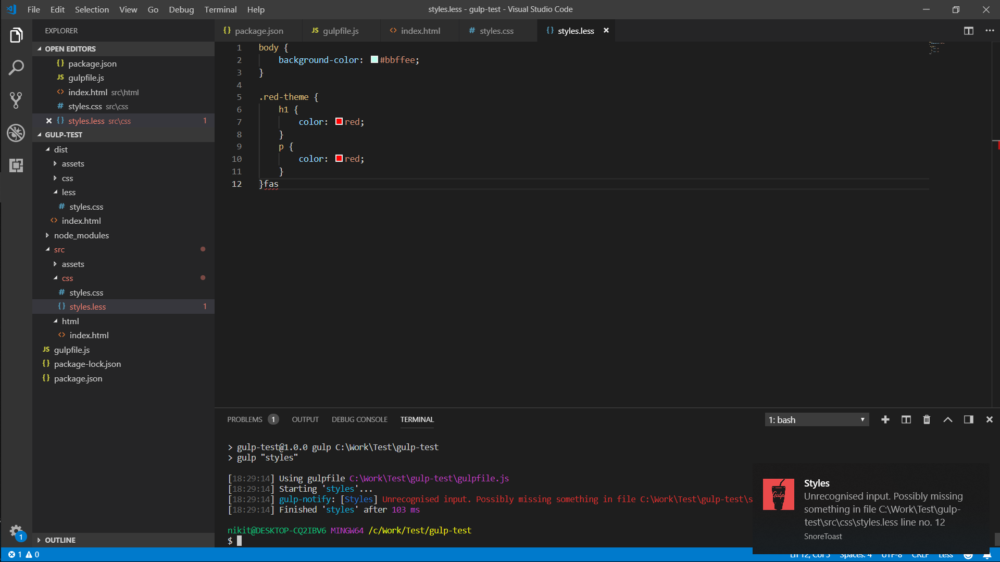

# Error notifications
## Prerequisites
Install Notify plugin:
```
> npm i gulp-notify --save-dev
```
Install Stream combiner 2 library:
```
> npm i stream-combiner2 --save-dev
```

## Description
Use _gulp-notify_ plugin to send notifications directly to OS.

To simplify code, use _stream-combiner2_ library, which will combine all task streams in one, on which error event can be listened and send to _gulp-notify_.



[Gulpfile](gulpfile.js)